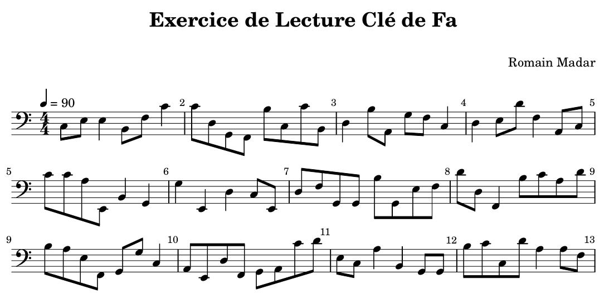

# Music Sheet

This repository holds a simple (WIP) python interface to generate music sheets using [Lylipond](http://lilypond.org/),
and export the corresponding audio file (mp3 format converted from MIDI using [timidity](https://launchpad.net/ubuntu/hirsute/+package/timidity)). This tool depends naturally on these two sofware. Caution: I am discovering Lylipond on the fly while I am writing this tool.

## Random sheet for practicing

The first use case is to be able to generate random scores with a given level of difficulty for both note range and rythm pattern.
An example can be found [here](example_random_score.py), producing this score:
