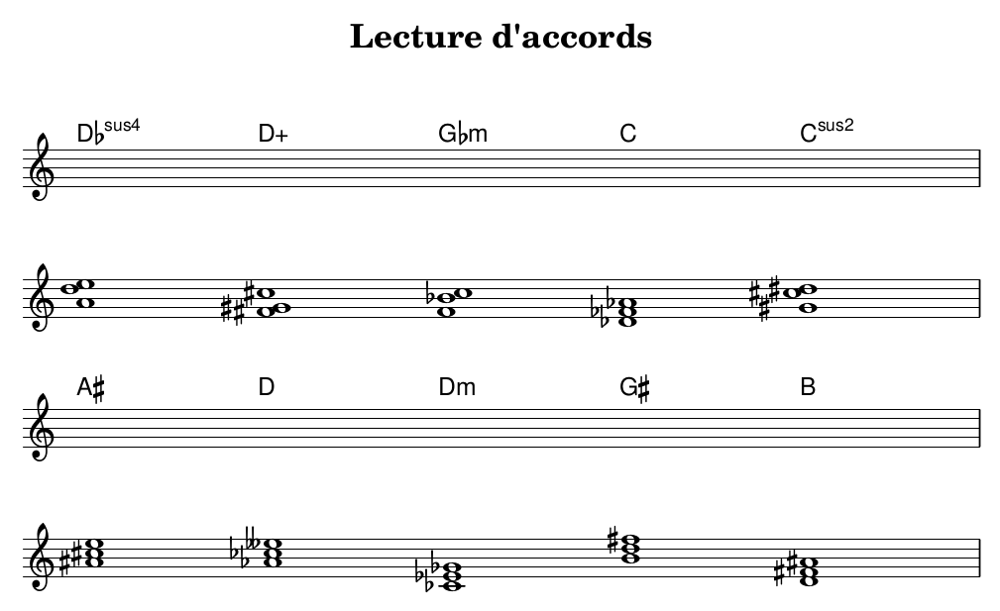
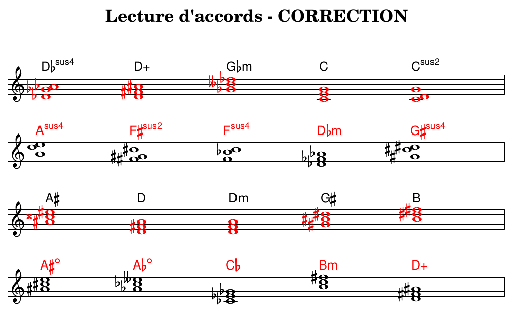
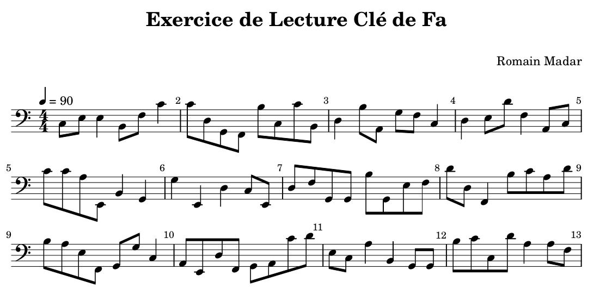
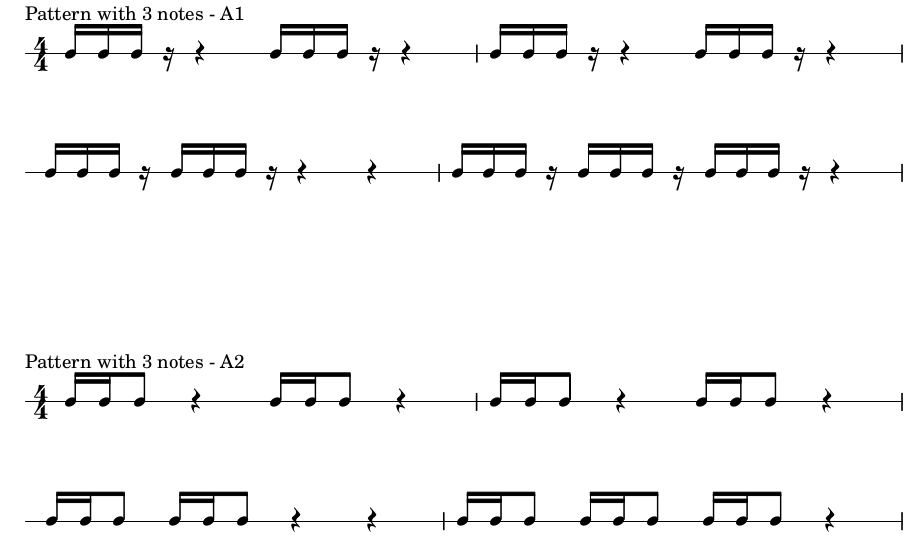

# Music Sheet with Lilypond and python

This repository holds a simple (WIP) python interface to generate music sheets using [Lylipond](http://lilypond.org/),
and export the corresponding audio file (mp3 format converted from MIDI using [timidity](https://launchpad.net/ubuntu/hirsute/+package/timidity)). This tool depends naturally on these two softwares.

## Practicing triad/tetrads chords and scales 

### What is implemented?

- 6 triads :
   1. major
   1. minor
   1. diminished
   1. augmented
   1. suspended2
   1. suspended4

- 13 tetrads:
   1. major 7
   2. major maj7
   3. minor 7
   4. minor maj7
   5. suspended4 7
   6. augmented 7
   8. augmented maj7
   9. half-diminished 7
   9. diminished 7
   10. diminished maj7
   11. major 6
   12. minor 6
   13. minor min6

- 12 chords of ninth:
   1. major add9 (ie major+9)
   2. major maj9 (ie maj7 w/ 9)
   3. major 69 (ie 6 w/ 9)
   4. major 9  (ie 7 w/ 9)
   5. major 7b9 (ie 7 w/ b9)
   6. major 7#9 (ie 7 w/ #9)
   7. minor 9 (ie 7 w/ 9)
   8. minor 9b5 (ie demi-dimished7 w/ 9)
   9. minor maj9 (ie min maj7 w/ 9)
   10. minor 69 (ie min 6 w/ 9)
   11. sus4 9 (ie suspended4 7 w/ 9)
   12. sus4 b9 (ie suspended4 7 w/ b9)

- 8 scales
   1. major
   2. natural minor
   3. harmonic minor
   4. melodic minor
   5. penta major
   6. penta minor
   7. blues major
   8. blues minor

- 7 modes:
   1. ionian
   2. dorian
   3. phrygian
   4. lydian
   5. myxolydian
   6. eolian
   7. locrian
 

## Example of triads

The tool offers the possibility to write exercises sheet to find triads names from the 3 notes, or find the 3 notes from the name.

The correction can also be generated with solutions in red.

## Practicing bass clef reading

The first use case is to be able to generate random scores with a given level of difficulty for both note range and rythm pattern.
An example can be found [here](exercise-reading/example_random_score.py), producing this score:

## Practicinng rythm patterns

Another use is to create simple and short phrases from basic pattern, based on 16th notes.

## TO-DO List

 - [ ] Re-think the rythm pattern including with distinction of different durations
 - [ ] Add chord inversion. Few remarks:
    + from root to any inversion (not too difficult)
    + from any inversion to root (more difficult)
    + define a chords based on 3 notes, whathever their otcave
    + above 3 notes, there is no unicity of chord definition (harmonic context needs to be taken into acount) !

